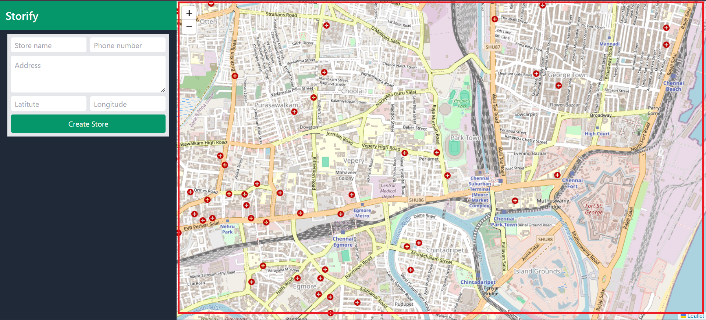
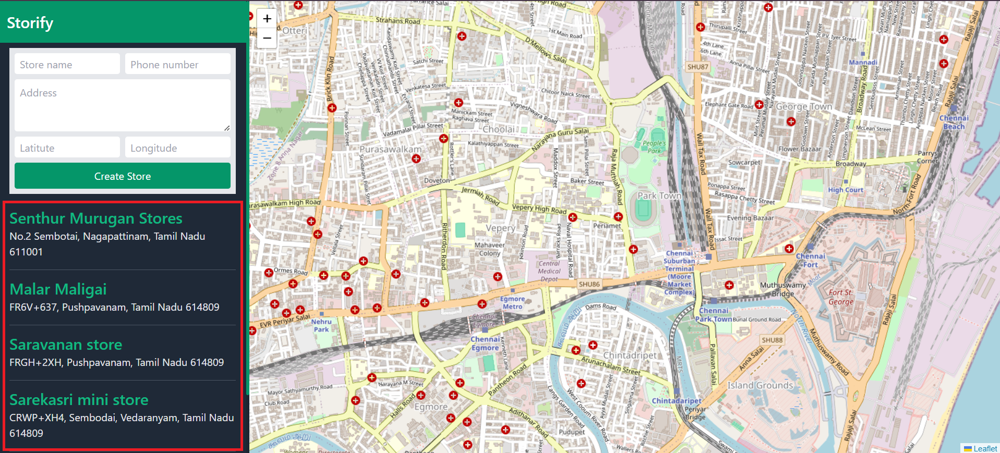
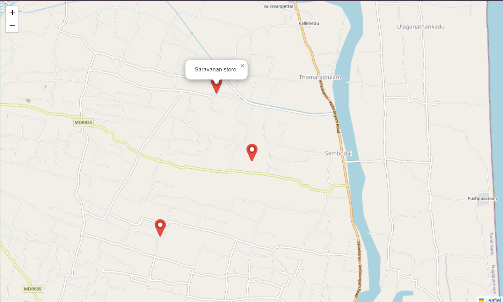
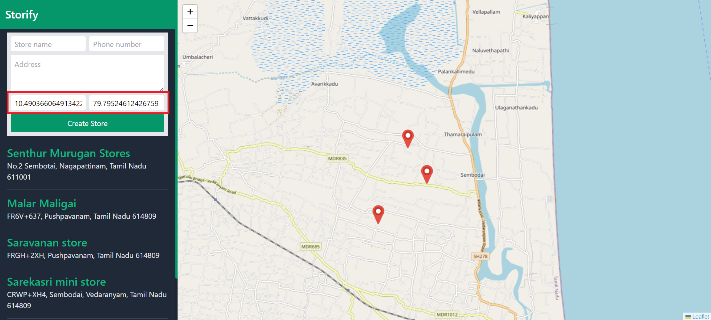
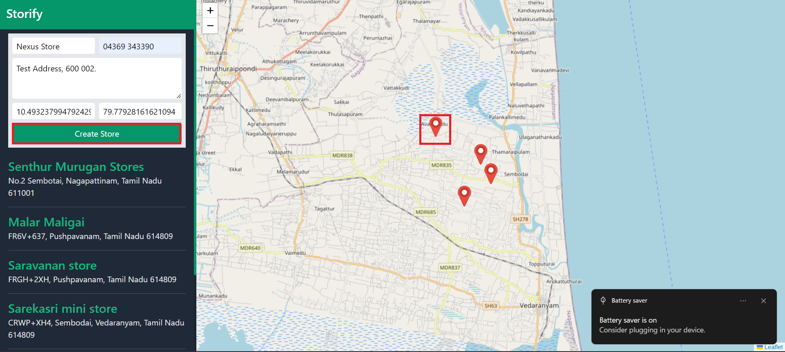
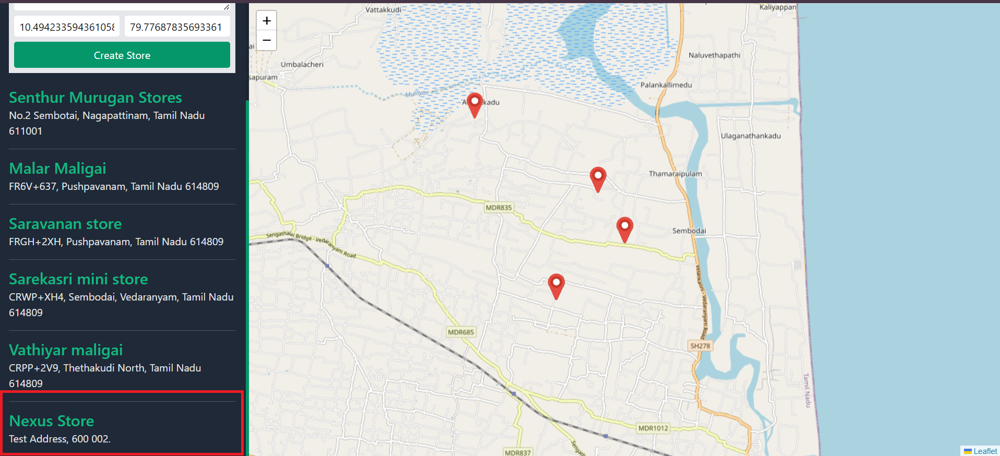

## GeoLocation API with leaflet library

<!-- navigator use to get current position -->

### Navigator

Get the current position using navigator in getCurrentPosition method.

#### Check navigation support in out browser

```
if(navigator.navigation){
    // implementation
    ...
}else{
    console.log("Your browser was not support's the navigation");
}
```

#### Get current position

The `getCurrentPosition` method take 3 arguments. The first 2 argument is the success & error callback function and third argument is the optional argument.

```
navigator.geolocation.getCurrentPosition(success, error);
```

#### Success callback

The success callback is receives the current position coordinates as a parameter. It's contains the latitude and longitude information.

```
function successCallback(position){
  const lat = position.coords.latitude;
  const lng = position.coords.longitude;
}
```

#### Error callback

The error callback receives the error object that contains the error code and the error message. based on the error code
displays the custom error message.

```
function error(error) {
  switch (error.code) {
    case 1:
      console.log("User denied the request for Geolocation.");
      break;
    case 2:
      console.log("Location service is unavailable.");
      break;
    case 3:
      console.log("The request to get user location timed out.");
      break;
    default:
      console.log("We couldn't retrieve your current location.");
      break;
  }
}
```

<!-- install the leaflet library -->

### Install the leaflet library

Install the leaflet library using cdn library. For mor information visit the
[Leaflet](https://leafletjs.com/download.html) website.

```
<!DOCTYPE html>
<html lang="en">
  <head>
    <meta charset="UTF-8" />
    <meta name="viewport" content="width=device-width, initial-scale=1.0" />
    <title>Geo Location with Leaflet</title>

    <!-- Link the css file of the leaflet -->
    <link
      rel="stylesheet"
      href="https://unpkg.com/leaflet@1.9.4/dist/leaflet.css"
      integrity="sha256-p4NxAoJBhIIN+hmNHrzRCf9tD/miZyoHS5obTRR9BMY="
      crossorigin=""
    />
   </head>

   <body>

   <!-- Script file from leaflet -->
    <script
        src="https://unpkg.com/leaflet@1.9.4/dist/leaflet.js"
        integrity="sha256-20nQCchB9co0qIjJZRGuk2/Z9VM+kNiyxNV1lvTlZBo="
        crossorigin=""
        ></script>
    </body>
</html>

```

<!-- Display the map -->

### Display the map

We receive the all methods and properties from leaflet `L` variable.

#### Configure the map container

Configure the Map container with appropriate html `div` container. We display the map in which have container id is `map`. The optional parameter of the map method from leaflet receives the center position information and control the zoom level.

```
const mapOptions = {
    center: [lat, lng],
    zoom: 15,
  };

map = L.map("map", mapOptions);
```

#### Adding the tile layer

Lot's of tile layers provider are available. Here we are using the tile layer from `opensteermap.org` for more details check on the site https://leaflet-extras.github.io/leaflet-providers/preview/.

```
  const layer = L.tileLayer(
    "https://{s}.tile.openstreetmap.org/{z}/{x}/{y}.png"
  );

  map.addLayer(layer);
```



<!-- Display the store with geoJSON -->

###Display the store with geoJSON
This is the format of the geoJSON. It have type, geometry and properties objects. geometry contains the position information.
properties contains the name of the store, address like other information's.

```
const storeList = [
  {
    type: "Feature",
    geometry: {
      type: "Point",
      coordinates: [79.8163561, 10.4620187],
    },
    properties: {
      name: "Senthur Murugan Stores",
      address: "No.2 Sembotai, Nagapattinam, Tamil Nadu 611001",
      phone: "04369 234567",
    },
  },
  {
    type: "Feature",
    geometry: {
      type: "Point",
      coordinates: [79.8163561, 10.4620187],
    },
    properties: {
      name: "Malar Maligai",
      address: "FR6V+637, Pushpavanam, Tamil Nadu 614809",
      phone: "04369 234567",
    },
  }];
```

Loop through the features from geoJSON and display all store information with help of leaflet.

```
const ul = document.getElementById("store-ul-list");

function createStore(store) {
  const li = document.createElement("li");
  const div = document.createElement("div");
  const a = document.createElement("a");
  const p = document.createElement("p");

  // li.classList.add("border-b","border-gray-200", "last:border-b-0");
  div.classList.add("mt-3");
  a.classList.add("text-green-500", "text-2xl", "font-semibold");
  p.classList.add("text-gray-200", "text-base");

  a.href = "#";
  a.addEventListener("click", () => {
    flyToStore(store);
  });
  a.innerText = store.properties.name;
  p.innerText = store.properties.address;

  div.appendChild(a);
  div.appendChild(p);
  li.appendChild(div);
  ul.appendChild(li);
}

function generateStoreList() {
  storeList.forEach((store) => {
    createStore(store);
  });
}

generateStoreList();
```



<!-- Display the marker for each store -->

### Display the marker for Each Store

Display the marker for each store with help of leaflet method passing the geoJSON data.

Create the custom marker with help of leaflet method. it's enable to customize icon image and size.

```
const iconOptions = {
    iconUrl: "./marker.png",
    iconSize: [50, 50],
  };

  const customIcon = L.icon(iconOptions)
```

Passing the geoJSON data to Leaflet geoJSON method.

```
// store layer
  const storeLayer = L.geoJSON(storeList, {
    onEachFeature: runForEachFeature,
    pointToLayer: function (feature, lat_lon) {
      return L.marker(lat_lon, {
        icon: customIcon,
      });
    },
  });

  map.addLayer(storeLayer);
```



<!-- Custom Popup -->

### Customize the Popup

We can able to customize the Popup

```
function runForEachFeature(feature, layer) {
    // implementation
    layer.bindPopup(customPopup(feature));
}

<!-- Custom Popup -->
function customPopup(store) {
  return `<div class="pb-4">
    <h4 class="bg-green-600 p-4 text-white text-xl font-semibold rounded-t-xl">${store.properties.name}</h4>
    <p class="text-gray-800 text-sm px-4">${store.properties.address}</p>
    <a class="text-sm px-4" href='tel:${store.properties.phone}' >${store.properties.phone}</a>
  </div>`;
}
```

now it's look like


<!-- Create a new Store -->
### Create a new Store

When i click on the map i receive the click event and capture current latitude and longitude then set these value's on the appropriate text field on form. cursor not appear in the screenshot.

```
  map.on("click", function (e) {
    const { lat, lng } = e.latlng;
    document.getElementById("latitude").value = lat;
    document.getElementById("longitude").value = lng;
  });
```



After filling the form when i click the submit button all value get from form and based on the blueprint of the Store Class the new store was created and displayed the store list and marker also pointed on the map.

#### Store Blueprint
```
class Store {
  constructor(coordinates, name, address, phone) {
    this.type = "Feature";
    this.geometry = {
      type: "Point",
      coordinates,
    };
    this.properties = {
      name,
      address,
      phone,
    };
  }
}
```

```
const submitButton = document.getElementById("submit-btn");

submitButton.addEventListener("click", function (event) {
  event.preventDefault();

  const lat = document.getElementById("latitude").value;
  const lng = document.getElementById("longitude").value;
  const name = document.getElementById("store-name").value;
  const address = document.getElementById("store-address").value;
  const phone = document.getElementById("store-phone").value;

  const latlng = [lng, lat];
  const newStore = new Store(latlng, name, address, phone);

  storeList.push(newStore);
  createStore(newStore);

  displayMarker();
});
```

```
function displayMarker() {
  const iconOptions = {
    iconUrl: "./marker.png",
    iconSize: [50, 50],
  };

  const customIcon = L.icon(iconOptions);

  function runForEachFeature(feature, layer) {
    // implementation
    layer.bindPopup(customPopup(feature));
  }

  // store layer
  const storeLayer = L.geoJSON(storeList, {
    onEachFeature: runForEachFeature,
    pointToLayer: function (feature, lat_lon) {
      return L.marker(lat_lon, {
        icon: customIcon,
      });
    },
  });

  map.addLayer(storeLayer);
}
```

### Final Output





###*Thank you! for Reading..*